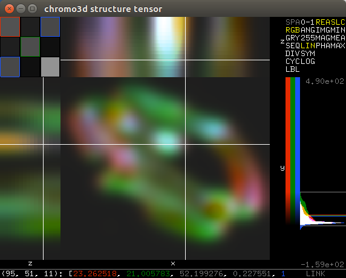

# DIPviewer {#viewer}

[//]: # (DIPlib 3.0)

[//]: # ([c]2016-2017, Cris Luengo.)
[//]: # (Based on original DIPlib code: [c]1995-2014, Delft University of Technology.)

[//]: # (Licensed under the Apache License, Version 2.0 [the "License"];)
[//]: # (you may not use this file except in compliance with the License.)
[//]: # (You may obtain a copy of the License at)
[//]: # ()
[//]: # (   http://www.apache.org/licenses/LICENSE-2.0)
[//]: # ()
[//]: # (Unless required by applicable law or agreed to in writing, software)
[//]: # (distributed under the License is distributed on an "AS IS" BASIS,)
[//]: # (WITHOUT WARRANTIES OR CONDITIONS OF ANY KIND, either express or implied.)
[//]: # (See the License for the specific language governing permissions and)
[//]: # (limitations under the License.)

## Introduction

*DIPlib* includes an OpenGL-based image viewer to help in the visualization
of intermediate results. Its main purpose is as a debugging tool. The
viewer contains two main classes

1. ImageViewer, to visualize 2d 8-bit RGB images
2. SliceViewer, to visualize 2d slices of n-d (tensor) images

More than one viewer can be active at the same time, and the separate
windows are managed by a primitive window manager. Two libraries are
supported for window management:

1. **GLUT** (GLUTManager):

   The venerable OpenGL Utility Toolkit, in the form of freeglut3.
   http://www.apache.org/licenses/LICENSE-2.0

2. **GLFW** (GLFWManager):

   GLFW is more modern than GLUT, and better supported by MacOS. Its
   disadvantage is that it requires the user to poll an event handler from
   the main thread of the program, something that is baked into the MacOS
   Cocoa framework.
   
   http://www.glfw.org/

To use the ImageViewer, the image must first be converted to 8-bit RGB,
for example using the \ref dip::ImageDisplay class. It does not have a user
interface, and just shows the image.

## User interface

SliceViewer is more elaborate. Its user interface consists of three
main parts

1. **Main visualization window**

  The main visualization window on the left shows three projections,
  nominally XY, XZ and YZ. The upper left corner visualizes the different
  tensor elements.

2. **Control panel**

  The control panel allows the user to select different ways of visualizing
  the image. It consists of four lists of options

  1. *Colorspace*, being
  
     - *SPA*: image colorspace, not yet implemented
     - *RGB*: RGB colorspace, from any 3 tensor elements
     - *GRY*: Single grey value
     - *JET*: Single value mapped to the Jet (blue-red) colormap
  
  2. *Mapping*, being

     - *0-1*: Unit values
     - *255*: 8-bit data
     - *LIN*: Linear interpolation between the global minimum and maximum values
     - *SYM*: Linear interpolation that is symmetric around 0
     - *LOG*: Logarithmic mapping

  3. *Complex mapping*, being

     - *REA*: Real part
     - *IMG*: Imaginary part
     - *MAG*: Magnitude, not yet implemented
     - *PHA*: Phase, not yet implemented

  4. *Projection*, being

     - *SLC*: Single slice around operating point
     - *MIN*: Minimum over dimensions perpendicular to slice
     - *MEA*: Mean over dimensions perpendicular to slice
     - *MAX*: Maximum over dimensions perpendicular to slice

3. **Histogram**

  The histogram shows both the frequency of intensities (100 bins between
  global minimum and maximum values), as well as the minimum and maximum
  values themselves. The colorbar left of the histogram shows how these
  values are mapped in the main visualization window. Changing the mapping
  in the control panel does not change the histogram extents, but does
  change the colorbar.

  The histogram also indicates the value of the operating point.

Interaction occurs mainly within the main visualization window, and depends
on where it occurs

- *Tensor elements*

  Within the tensor visualization subwindow, left-clicking selects the
  tensor element to visualize. If the RGB colorspace is chosen,
  left-clicking allocates the next available color (R, G or B) until three
  elements have been selected. Left-clicking on an already selected element
  deselects it.

- *Slices*

  Left-clicking in a slice changes the operating point for the visualized
  dimension(s). If slice projection is used, this will also affect the
  slices that are being visualized in the other projections.

  Right-dragging gives some limited control over the relative sizes of the
  three projections.

  Middle-dragging moves the slice, which is convenient when zooming in.

  Scroll wheel zooms in and out, centering in the current cursor position.
  Zooming in on the ancillary windows (nominal XZ and YZ) only zooms the Z
  dimension relatively.

- *Slice labels*

  Right-clicking on a slice label changes the visualized dimension for that
  projection. In the special case of selecting '-', a 1d slice is shown.
  Note that the horizontal dimensions of the nominal XY and XZ slices are
  necessarily the same, as are the vertical dimensions of the nominal XY and
  YZ slices.

## Usage example

See test_viewer.cpp in the test/ subdirectory for a usage example.
